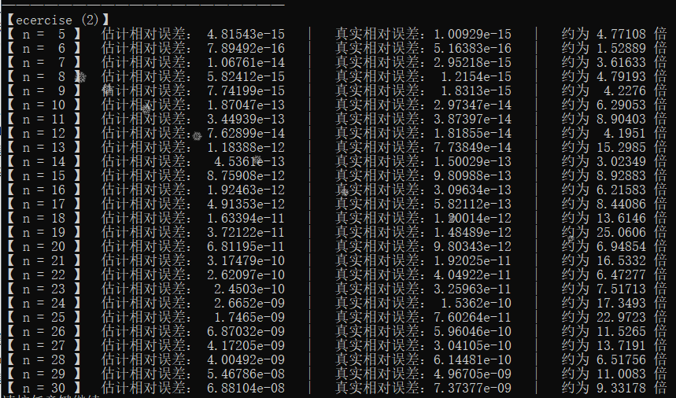

## 【Report】Homework 2**

### **一.【问题描述】**

实现矩阵范数计算、方程求解误差分析。

## **二.【程序介绍】**

程序包含两个主要文件 `Funcion.h` 和 `Ecercise.h` 。

`Funcion.h` 中实现矩阵类（支持各种基本运算、矩阵转置、LU 分解和 Cholesky 分解），基本方程组求解方法，和范数计算方法。

```cpp
class Matrix {
public:
    Matrix Hilbert () {}//把自己填充成Hilbert矩阵
	Matrix Sign () const {}//提取符号
	
private:
};

/*求解1范数*/
double Norm_1(Matrix A){}
/*求解1范数及最大值对应列*/
double Norm_1(Matrix A,int &p){}
/*求解∞范数*/
double Norm_inf(Matrix A){}
/*求解∞范数及最大值对应行*/
double Norm_inf(Matrix A,int &p){}
/*求解矩阵逆的∞范数*/
double Norm_invinf(Matrix A){}
/*求解∞范数条件数*/
double Cond_inf(Matrix A){}
```

`Ecercise.h` 中分别构造 `Hilbert` 矩阵计算、随机向量 `xr` 进行反方程组求解并分析误差。

<div STYLE="page-break-after: always;"></div>
## **三.【实验结果】**

### **(1).输出无穷范数条件数**


<div STYLE="page-break-after: always;"></div>
### **(2).误差分析**

随着阶数的增大，误差逐渐增大。估计相对误差保持在真实相对误差的 $1\sim 25$ 倍之间。



<div STYLE="page-break-after: always;"></div>