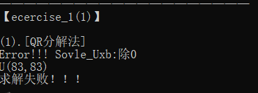
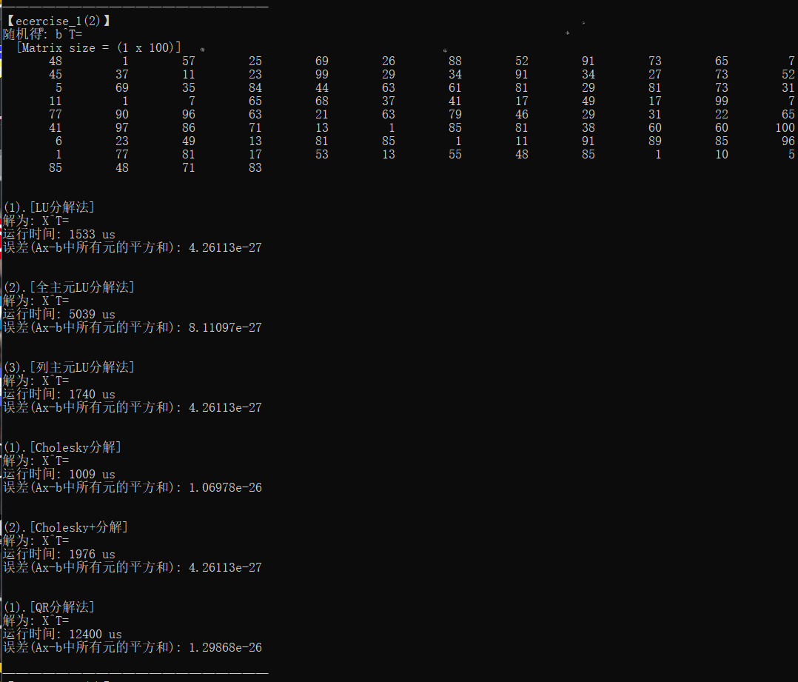
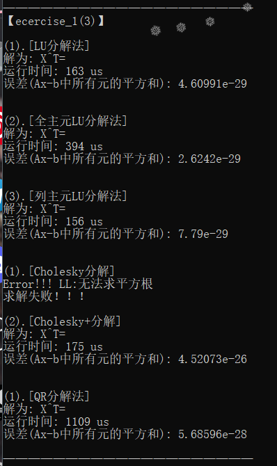
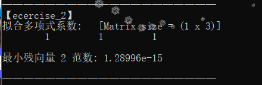
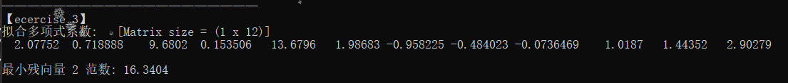

## 【Report】Homework3

### **一.【问题描述】**

实现QR分解算法求解线性方程组、最小二乘问题。

## **二.【程序介绍】**

程序包含两个主要文件 `Funcion.h` 和 `Ecercise.h` 。

`Funcion.h` 中实现矩阵类（支持各种基本运算、矩阵转置、LU 分解、Cholesky 分解、QR分解），基本方程组求解方法，和范数计算方法。

```cpp
class Matrix {
public:
    Matrix house(Matrix x,double &beta){}//计算householder变换向量
	Matrix QR(){}//QR分解(HouseHoder法) 
	
private:
};

/*求解成功返回答案矩阵，否则返回空矩阵*/
Matrix Solve_QR(Matrix A, Matrix b){}//QR分解法
```

`Ecercise.h` 中分别构造矩阵求解并分析误差。

<div STYLE="page-break-after: always;"></div>
## **三.【实验结果】**

### **1.分别对三组方程求解**







第一组方程，无法求解。

第三组方程，QR分解法计算精度优于Cholesky+分解法，其余比较均劣于其他方法。

时间消耗上，QR分解法为其他方法的数倍，差距明显。

<div STYLE="page-break-after: always;"></div>
### **2.最小二乘问题**




### **3.最小二乘问题**

