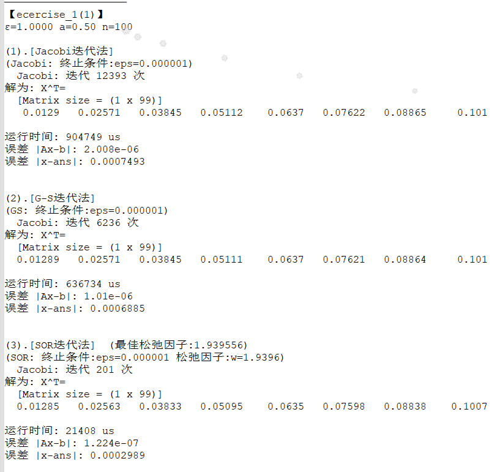
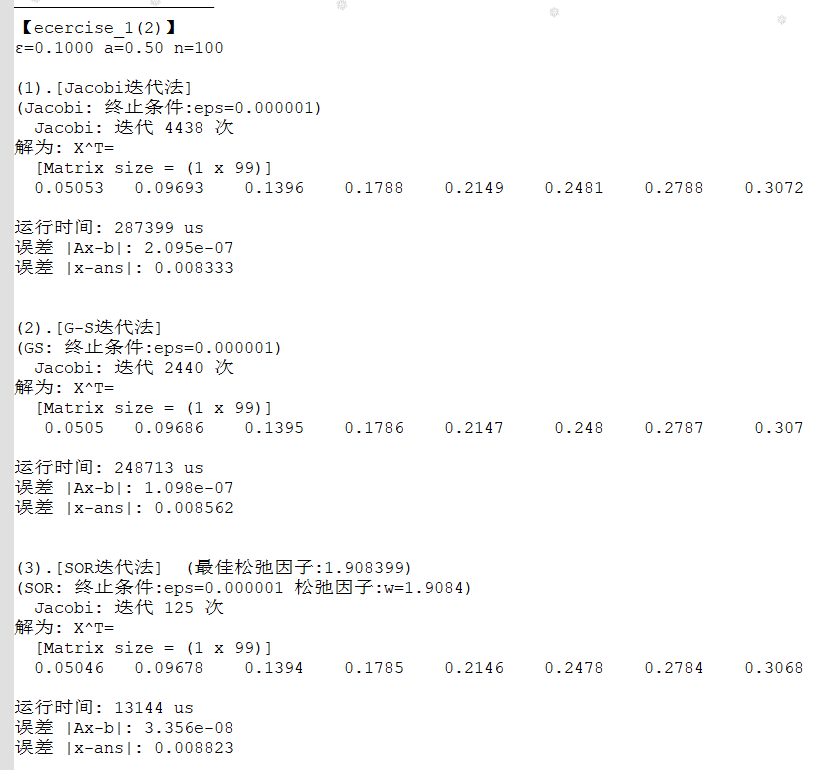
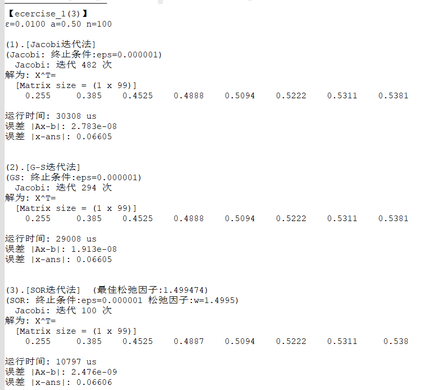
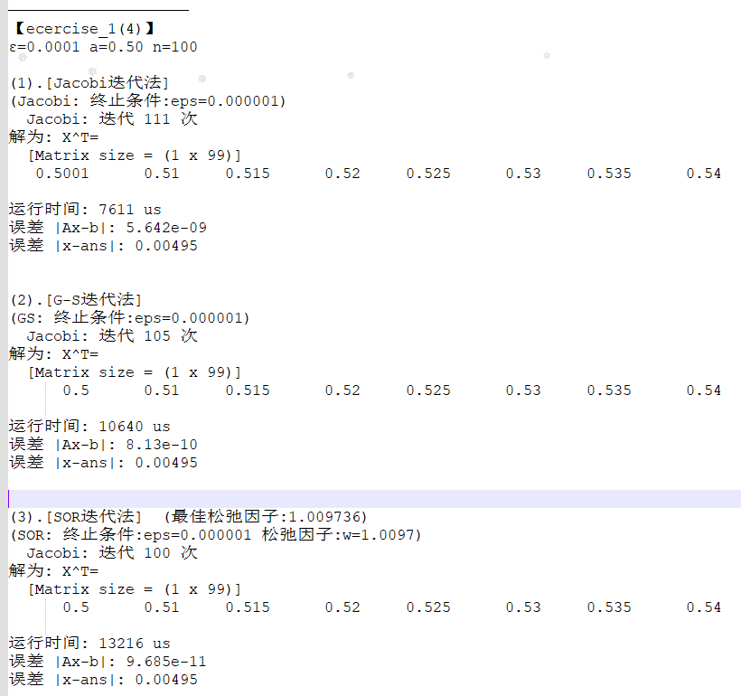

## 【Report】Homework4

### **一.【问题描述】**

实现Jacobi迭代法、G-S迭代法、SOR迭代法求解方程组。

## **二.【程序介绍】**

程序包含两个主要文件 `Funcion.h` 和 `Ecercise.h` 。

`Funcion.h` 中实现矩阵类（支持各种基本运算、矩阵转置、LU 分解、Cholesky 分解、QR分解），基本方程组求解方法，方程组古典迭代解法，和范数计算方法。

```cpp
class Matrix {
public:
    /*迭代至满足精度要求返回答案矩阵，否则返回空矩阵*/
    Matrix Jacobi(Matrix A,Matrix b,double eps){}
    Matrix GS_SOR(Matrix A,Matrix b,double eps,double w=0){}
private:
};

/*求解成功返回答案矩阵，否则返回空矩阵*/
Matrix Solve_QR(Matrix A, Matrix b){}//QR分解法
```

`Ecercise.h` 中分别构造矩阵 `A,b`，`calc1` 函数计算精准解 `ans`，`find` 函数三分查找最优松弛因子。

```cpp
inline double find(Matrix &A,Matrix &b,double &eps){}
double calc1(double x,double ep,double a){}
```

<div STYLE="page-break-after: always;"></div>
## **三.【实验结果】**

### **1.两点边值问题**

对于相同 $\epsilon$ 值，迭代次数和误差均为SOR优于G-S优于Jacobi，当 $\epsilon$ 较小时三者误差 趋于近似。

随着 $\epsilon$ 值的减小，三种方法的迭代次数和误差都显著降低，SOR法的最佳松弛因子逐渐减小。










<div STYLE="page-break-after: always;"></div>
