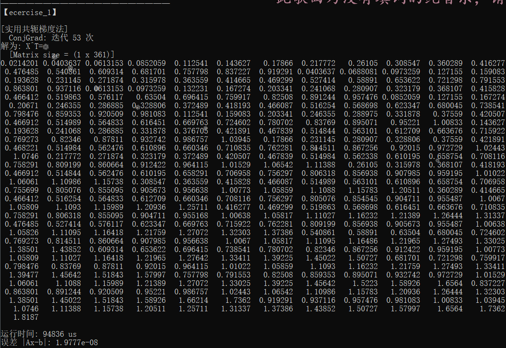
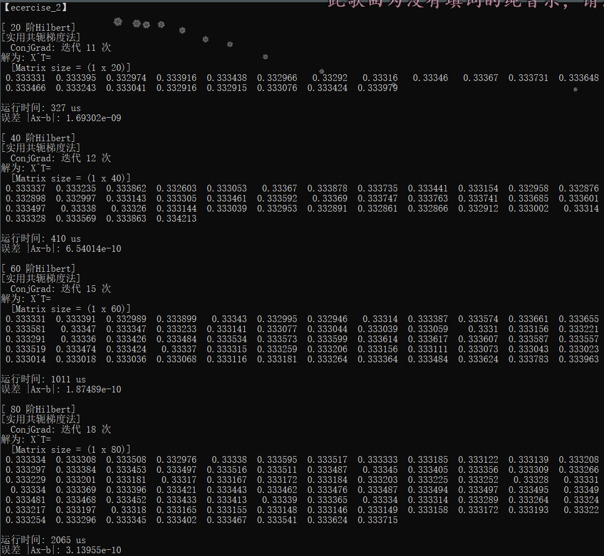
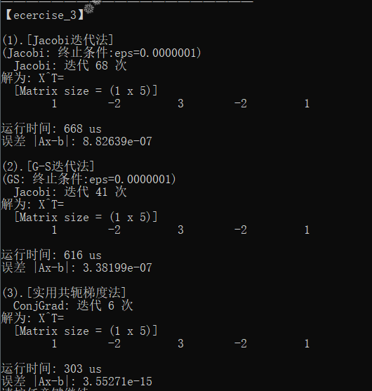

## 【Report】Homework5

### **一.【问题描述】**

实现实用共轭梯度法。

## **二.【程序介绍】**

程序包含两个主要文件 `Funcion.h` 和 `Ecercise.h` 。

`Funcion.h` 中实现矩阵类（支持各种基本运算、矩阵转置、LU 分解、Cholesky 分解、QR分解），基本方程组求解方法（上三角、下三角、Guass、全主元Guass、列主元Guass、Cholesky、Cholesky改进），范数计算方法（1范数、无穷范数），方程组古典迭代解法（Jacobi、G-S、JOR）和实用共轭梯度法。

```cpp
class Matrix {
public:
    /*迭代至满足精度要求返回答案矩阵，否则返回空矩阵*/
    Matrix ConjGrad(Matrix A,Matrix b,double eps){}//实用共轭梯度法
private:
};
```

`Ecercise.h` 中分别构造矩阵 `A,b` 求解。

<div STYLE="page-break-after: always;"></div>
## **三.【实验结果】**

### **1.Dirichlet问题**



### **2.Hilbert系数方程**

取迭代终止条件为 $||x_{k+1}-x_{k}||_{\infty}<10^{-7}$。随着方程阶数上升，迭代次数逐渐提高。但在阶数较高的情况下，运行效率和精度误差仍十分优秀。



### **3.迭代法比较**

取迭代终止条件为 $||x_{k+1}-x_{k}||_{\infty}<10^{-7}$。共轭梯度法精度和迭代次数均远优于 Jacobi 和 G-S，但运行时间相差不大。

Jacobi 和 G-S 运行时间相差不大，后者略优。




<div STYLE="page-break-after: always;"></div>
