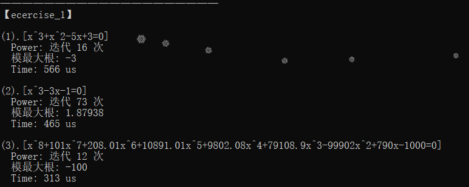
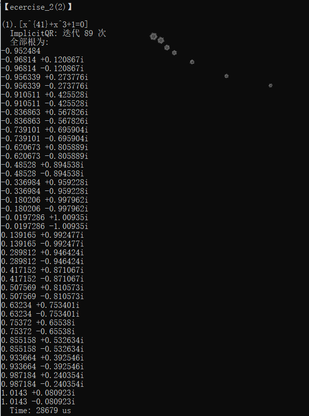
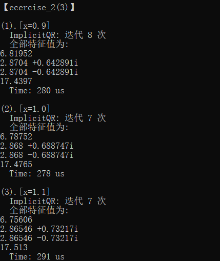

## 【Report】Homework6

### **一.【问题描述】**

实现幂法求模特征根、上Hessenberg分解、双重步位移QR迭代、隐式QR法。

## **二.【程序介绍】**

程序包含两个主要文件 `Funcion.h` 和 `Ecercise.h` 。

`Funcion.h` 中实现矩阵类（支持各种基本运算、矩阵转置、LU 分解、Cholesky 分解、QR分解、上Hessenberg化、双重步位移QR迭代），基本方程组求解方法（上三角、下三角、Guass、全主元Guass、列主元Guass、Cholesky、Cholesky改进），范数计算方法（1范数、无穷范数），方程组古典迭代解法（Jacobi、G-S、JOR），实用共轭梯度法，幂法求模最大根，隐式QR算法。

```cpp
class Matrix {
public:
    _Matrix Hessenberg(){}//上Hessenberg化
	_Matrix DoubleStepQR(){}//双重步位移QR迭代
private:
};

/*迭代至满足精度要求返回答案矩阵，否则返回空矩阵*/
Matrix Power(Matrix A,double eps){}//幂法
Matrix Friend(vector<double> a){}//根据多项式系数构造友方阵
double MaxRoot(vector<double>a,double eps){}//模最大根
inline void vieta_root(Matrix A,CP &x1,CP &x2){}//解二阶矩阵特征根
/*将特征根存入vector*/
void Schur(Matrix A,vector<CP> &ans){}//Schur分解求特征值
void ImplicitQR_(Matrix A,vector<CP> &ans,int &deep){}//隐式QR递归迭代函数
/*返回所有特征根*/
vector<CP> ImplicitQR(Matrix A){}//隐式QR算法
```

`Ecercise.h` 中分别构造矩阵 `A` 求解。

<div STYLE="page-break-after: always;"></div>
## **三.【实验结果】**

### **1.多项式模最大根**

根据运行结果，迭代次数与多项式次数关系不大。



### **2(2).多项式全部根**

取。



### **2(3).矩阵全部特征值**

随着 $x$ 的增大，方程实根和虚根的实部均递减，虚根的虚部递增。




<div STYLE="page-break-after: always;"></div>
