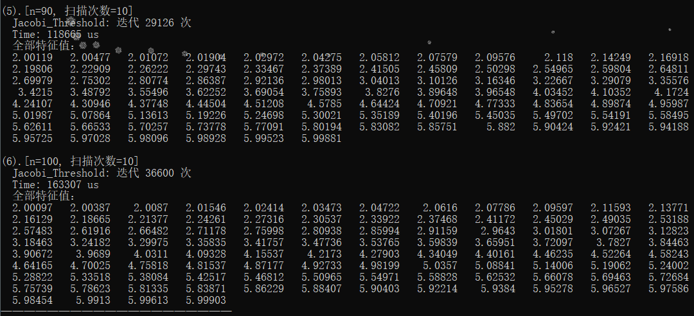

## 【Report】Homework7

### **一.【问题描述】**

实现过关Jacobi法、二分法、反幂法。

## **二.【程序介绍】**

程序包含两个主要文件 `Funcion.h` 和 `Ecercise.h` 。

`Funcion.h` 中实现矩阵类（支持各种基本运算、矩阵转置、LU 分解、Cholesky 分解、QR分解、上Hessenberg化、双重步位移QR迭代），基本方程组求解方法（上三角、下三角、Guass、全主元Guass、列主元Guass、Cholesky、Cholesky改进），范数计算方法（1范数、无穷范数），方程组古典迭代解法（Jacobi、G-S、JOR），实用共轭梯度法，幂法求模最大根，隐式QR算法，过关Jacobi法，二分法求第K大特征值，反幂法。

```cpp
class Matrix {
public:
    _Matrix Identity () {}//把自己填充成单位矩阵
private:
};

/*进行ed次扫描，返回变换矩阵*/
Matrix Jacobi_Threshold(Matrix &A,int ed=10){}//过关Jacobi法
/*二分迭代至满足精度要求，返回第K大特征值*/
double Bisection(int K,Matrix x,Matrix y,double eps=1e-10){}//二分法
/*迭代至满足精度要求返回答案矩阵，否则返回空矩阵*/
Matrix Inverse_Power(Matrix A,double lambda,double eps=1e-10){}//反幂法
```

`Ecercise.h` 中分别构造矩阵求解。

<div STYLE="page-break-after: always;"></div>
## **三.【实验结果】**

### **1.过关Jacobi法**

扫描次数：$10$




### **2.二分法+反幂法**

精度要求取：$eps=10^{-10}$


<div STYLE="page-break-after: always;"></div>
