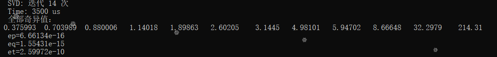
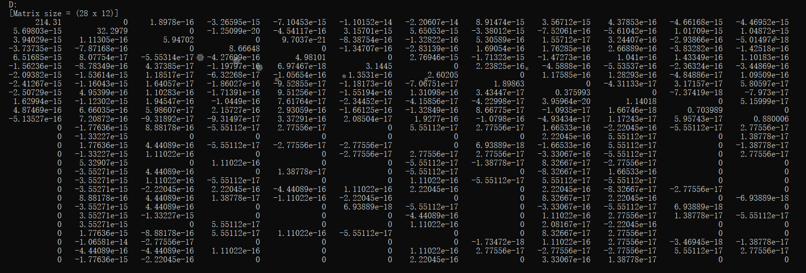
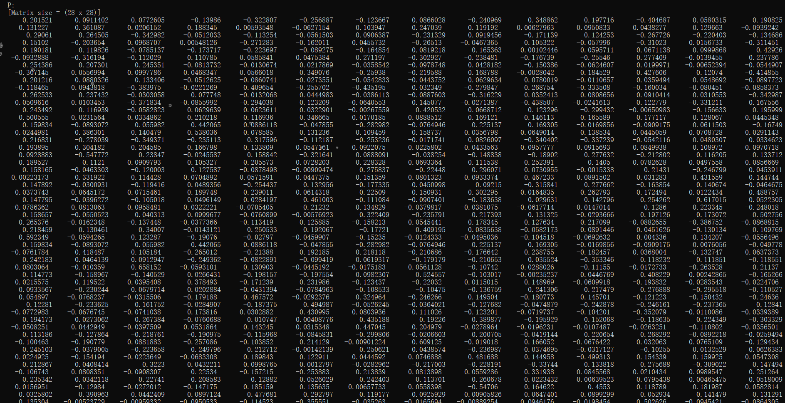
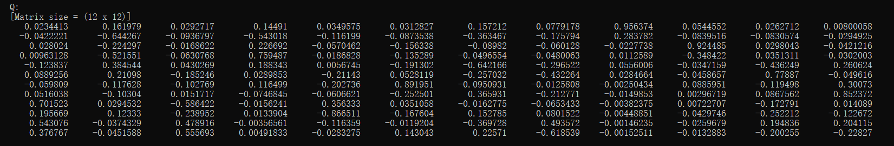

## 【Report】Homework8

### **一.【问题描述】**

实现SVD迭代。

## **二.【程序介绍】**

程序包含两个主要文件 `Funcion.h` 和 `Ecercise.h` 。

`Funcion.h` 中实现矩阵类（支持各种基本运算、矩阵转置、LU 分解、Cholesky 分解、QR分解、上Hessenberg化、双重步位移QR迭代、二对角化），基本方程组求解方法（上三角、下三角、Guass、全主元Guass、列主元Guass、Cholesky、Cholesky改进），范数计算方法（1范数、无穷范数），方程组古典迭代解法（Jacobi、G-S、JOR），实用共轭梯度法，幂法求模最大根，隐式QR算法，过关Jacobi法，二分法求第K大特征值，反幂法，SVD迭代。

```cpp
class Matrix {
public:
    _Matrix TwoDiag(_Matrix &P,_Matrix &Q){}//二对角化
private:
};

/*迭代至满足要求返回D=PAQ*/
Matrix SVD(Matrix A,Matrix &P,Matrix &Q,double eps=1e-10){}//SVD迭代
```

`Ecercise.h` 中构造矩阵 `A` 求解。

<div STYLE="page-break-after: always;"></div>
## **三.【实验结果】**




求解结果表示为：$D=PAQ$ 






